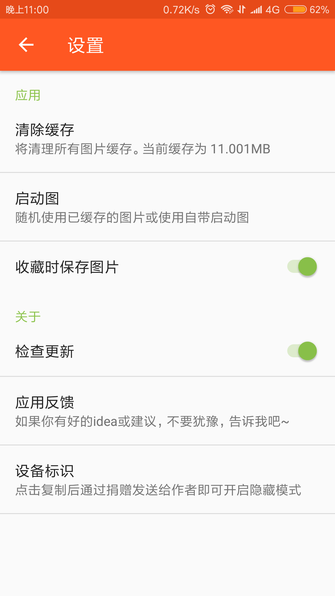

# Beauty
五次元妹子 是一款看妹子的APP

* 仿照开源项目["五次元妹子"App](https://github.com/DanteAndroid/Beauty)
* 目前建议你们还是模仿原项目,原作者的项目问题反馈群:459232356
* 书籍推荐：
  * 送个大礼包给小伙伴们:[免费编程书籍笔记大全(英文)](http://goalkicker.com/)
  * 看不懂英文的还可以看中文的:《第二行代码》以及《Android开发艺术探索》
  * 阿里巴巴开源的《Java开发手册》,《深入探索Android热修复技术原理》以及关于
    双十一书籍都很不错,网上搜索即可或者关注"阿里技术"也可以获取
  * 很多人都推荐买《Android进阶之光》,《Android群英传》或者《Android高级进阶》
    这类的书籍，这里我持有保留意见，基于开发者水平参差不齐，所以我觉得刚入门的开
    发者还是读完了以上几乎零差评的两本Android经典书再自行决定是否购买这些

### 项目截图

### 模仿项目感言
* 在学习Android技术上,最好的学习办法就是根据项目去掌握知识,这方面我有过很深的坑
  试过的,模仿的项目要找一些著名开源项目,切忌为了简单找一些简单项目,我在这里就被坑
  了,找了一个不出名的GitHub项目[qht1003077897/H-Express: 仿 快递100的一款”快递助手”APP](https://github.com/qht1003077897/H-Express)
  ,这个项目第一是项目命名不规范,第二点是他的代码逻辑写的不给力(坑到爆炸),所以
  我果断弃坑了
  * PS:写下来不是为了拉仇恨,只是为了给自己以及看到的人一个警醒
  * 这个五次元项目是一个很值得模仿的项目,希望各个亲们可以尝试一下的

### 推荐项目:
* [simplebam/Weather: 天气应用App合集](https://github.com/simplebam/Weather)
* [simplebam/Todolist: 这是一个只专注于帮助你记录、管理日常计划任务的界面简洁清爽工具类APP。 ](https://github.com/simplebam/Todolist)
* [BryantPang/ReadHub: ReadHub 第三方安卓客户端](https://github.com/BryantPang/ReadHub)
* [ListenerMusicPlayer：一款优雅的遵循 Material Design 的开源音乐播放器]( https://www.diycode.cc/projects/hefuyicoder/ListenerMusicPlayer)
* [sealtalk/sealtalk-android: Android App of SealTalk powered by RongCloud. 基于融云开发的 Android 版即时通讯（IM）应用程序 - 嗨豹。 ](https://github.com/sealtalk/sealtalk-android)
项目不在多,在于你自己对知识点的领悟

### 推荐阅读
* [中文技术文档的写作规范 - DiyCode](https://www.diycode.cc/topics/941)
* [Android：手把手带你 使用 熟悉而陌生的Application类 - 掘金 ](https://juejin.im/post/5a5413f4f265da3e497fe8b9)
* [一行代码快速解耦Application逻辑，让Application更简洁好维护 - 简书 ](https://www.jianshu.com/p/23b9ba9b685d?utm_source=gank.io&utm_medium=email)
* [Android图片压缩的几种方案 ](http://mp.weixin.qq.com/s/-ixGY5E34Fbsy0N3-XTk-Q?utm_source=gank.io&utm_medium=email)
* [Java——常量池探索 - CSDN博客 ](https://blog.csdn.net/qian520ao/article/details/78988417)
* [最接地气的Android面试总结心得 - 简书 ](https://www.jianshu.com/p/d800165da455)
* [Android 能让你少走弯路的干货整理 - 简书 ](https://www.jianshu.com/p/514656c383a2)

### Support
如果你喜欢这个repository，请我喝杯咖啡，我会让它更完美~  

